# uSTAT — LLM Reference Manual

**Purpose.** This file is written for a chat assistant (LLM). A user will say
something like *"I uploaded my data to uSTAT — which tests should I run and how
do I run them in uSTAT?"* Use this document to (1) recommend the right analysis
for their data and question, and (2) give exact, click-by-click steps for the
uSTAT web app at <https://ustat.drtr.uk>.

uSTAT is a browser-based clinical/biostatistics app. Data lives in server RAM
only, is never written to disk, and is auto-discarded ~30 min after the last
action. It is **not** a validated medical device — always tell the user to
confirm important results against SPSS/R/Stata/SAS.

> How to use this manual as an LLM:
> 1. Map the user's question + variable types to a row in the **Master Test
>    Index** below.
> 2. Open the matching **per-tab section** for the exact navigation path,
>    required variables, and steps.
> 3. Every panel in uSTAT also shows its own *When to use / Assumptions /
>    How to read* card — reassure the user those notes are on-screen.

---

## 1. How uSTAT is organized

After the user uploads a file, the top navigation bar shows these **tabs**
(left → right). Some tabs contain a second row of **sub-tabs**.

| Tab | Sub-tabs | What lives here |
|-----|----------|-----------------|
| **Data** | — | Spreadsheet view, variable typing, cleaning, Select Cases, Filter, missing badges |
| **Summary** | Descriptive · Weighted | Descriptive stats, histogram, boxplot, violin, Q-Q |
| **Table** (Table 1) | — | Clinical baseline "Table 1" by group |
| **Tests** | Hypothesis · Repeated Measures · Categorical · Reliability · Non-Inferiority · Gatekeeping · Factor Analysis · Bayesian Statistics | Classic hypothesis tests |
| **Correlation** | — | Pearson / Spearman / Kendall, correlation matrix |
| **ROC** | — | ROC curve, AUC, DeLong comparison, combined model |
| **Models** | Regression · Survival Advanced · Restricted Cubic Spline · Machine Learning · Time Series · Validation | Regression, survival, ML, forecasting, validation |
| **PSM** | — | Propensity-score matching |
| **IPTW** | — | Inverse-probability-of-treatment weighting |
| **Causal+** | — | IV/2SLS, mediation, SEM / Path analysis, target trial, DiD, RDD, DAG |
| **DCA** | — | Decision-curve analysis (net benefit) |
| **Meta** | — | Meta-analysis, subgroup, meta-regression, publication bias |
| **Missing** | — | Missing-data audit + multiple imputation (MICE) |
| **Visual** | Models & Diagnostics · Charts · Subgroup Bar · Forest plot · Added Predictive Value | Visual model combos, custom charts, forest builder |
| **Compute** | — | Recode, formula columns, clinical calculators (BMI, eGFR, CHA₂DS₂-VASc) |
| **Power** | — | Power / sample-size (no data needed; also on the splash screen) |

**Global search:** the search box at the top ("Search tests / models…") jumps
straight to any analysis by name or alias — tell users they can type e.g.
"Cox", "kappa", "mediation", or Turkish aliases ("lojistik", "eksik veri").

---

## 2. Master Test Index

Find the analysis, go to the tab/sub-tab, prepare the listed variable types.
*(num = numeric, cat = categorical, ord = ordered categorical; mark types in
the Data tab by clicking a column's type badge or via the Dictionary modal.)*

### Descriptive & baseline
| Analysis | Tab → sub-tab | Needs |
|----------|---------------|-------|
| Descriptive statistics | Summary → Descriptive | any |
| Histogram / Boxplot / Violin / Q-Q | Summary → Descriptive | 1 num (+ optional cat group) |
| Weighted descriptives (survey weights) | Summary → Weighted | num + weight col |
| Table 1 (clinical baseline) | Table | a grouping cat + any vars |

### Group comparisons (hypothesis tests)
| Analysis | Tab → sub-tab | Needs |
|----------|---------------|-------|
| One-sample t-test | Tests → Hypothesis | 1 num |
| Independent (two-sample) t-test | Tests → Hypothesis | 1 num + 1 cat (2 levels) |
| One-way ANOVA | Tests → Hypothesis | 1 num + 1 cat (≥3 levels) |
| Two-way ANOVA / ANCOVA / MANCOVA | Tests → Hypothesis | num outcome(s) + cat factors (+ num covariate) |
| Mann-Whitney U | Tests → Hypothesis | 1 num/ord + 1 cat (2 levels) |
| Kruskal-Wallis | Tests → Hypothesis | 1 num/ord + 1 cat (≥3 levels) |
| Jonckheere-Terpstra (ordered trend) | Tests → Hypothesis | 1 num + 1 ord group |
| Paired t-test / Wilcoxon signed-rank | Tests → Repeated Measures | 2 paired num cols |
| Repeated-measures / Mixed ANOVA / Friedman | Tests → Repeated Measures | ≥2 paired num cols (+ between factor) |

### Categorical associations
| Analysis | Tab → sub-tab | Needs |
|----------|---------------|-------|
| Chi-square / Fisher's exact | Tests → Categorical (or → Hypothesis) | 2 cat |
| Binomial / one- & two-proportion z | Tests → Categorical | 1–2 cat |
| McNemar / Cochran's Q | Tests → Categorical | paired cat |
| Mantel-Haenszel (stratified OR) | Tests → Categorical | 2 cat + 1 stratum cat |
| Cochran-Armitage trend | Tests → Categorical | ordered cat + binary |

### Agreement / reliability / structure
| Analysis | Tab → sub-tab | Needs |
|----------|---------------|-------|
| Cronbach's α | Tests → Reliability | ≥2 num items |
| ICC (intraclass correlation) | Tests → Reliability | ≥2 num rater cols |
| Fleiss' / Cohen's κ | Tests → Reliability | rater cat cols |
| Bland-Altman / Deming / Passing-Bablok | (Agreement — via search) | 2 num methods |
| PCA / Factor analysis | Tests → Factor Analysis | ≥3 num |
| Bayesian t-test / correlation / regression | Tests → Bayesian Statistics | per test |
| Gatekeeping (multiplicity, Hochberg/Holm) | Tests → Gatekeeping | a set of p-values |
| Non-inferiority (RR/RD/OR/mean + margin) | Tests → Non-Inferiority | per design |

### Correlation
| Analysis | Tab | Needs |
|----------|-----|-------|
| Pearson / Spearman / Kendall + matrix | Correlation | ≥2 num/ord |

### Diagnostic accuracy
| Analysis | Tab | Needs |
|----------|-----|-------|
| ROC curve + AUC | ROC | 1 num score + 1 binary outcome |
| DeLong AUC comparison / Multi-curve / Combined model | ROC | ≥2 num scores + 1 binary outcome |

### Regression
| Analysis | Tab → sub-tab | Needs |
|----------|---------------|-------|
| Linear regression | Models → Regression | num outcome + predictors |
| Logistic / Firth logistic | Models → Regression | binary outcome + predictors |
| OR table (uni + multivariable) | Models → Regression | binary outcome + predictors |
| Ordinal logistic (+ **Brant** prop-odds test) | Models → Regression | ordered-cat outcome + predictors |
| Poisson / Negative binomial / Gamma GLM | Models → Regression | count/positive outcome + predictors |
| Polynomial / Stepwise selection | Models → Regression | num outcome + predictors |
| Mixed-effects (LMM) / GEE | Models → Regression | outcome + predictors + cluster id |
| Restricted cubic spline (dose-response) | Models → Restricted Cubic Spline | num predictor + outcome |

### Survival (time-to-event)
| Analysis | Tab → sub-tab | Needs |
|----------|---------------|-------|
| Kaplan-Meier + log-rank | Models → Survival Advanced (Kaplan-Meier) | time num + event 0/1 (+ group) |
| Cox proportional hazards (+ Schoenfeld) | Models → Survival Advanced (Cox PH) | time + event + predictors |
| Time-horizon HR forest | Models → Survival Advanced (Time-horizon HR) | time + event + predictor |
| Landmark analysis | Models → Survival Advanced (Landmark) | time + event + predictors |
| RMST (restricted mean survival) | Models → Survival Advanced (RMST) | time + event + group |
| Fine-Gray competing risks (sHR/CIF) | Models → Survival Advanced (Fine-Gray) | time + event (≥2 causes) |
| Recurrent events (LWYY) | Models → Survival Advanced (Recurrent) | id + start/stop + event |
| **Interval-censored** (Turnbull NPMLE + Weibull) | Models → Survival Advanced (Interval-censored) | lower-bound + upper-bound num (+ covariates) |
| E-value (unmeasured confounding) | Models → Survival Advanced (E-value) | an estimate + CI |
| RCS-Cox (multivariable spline survival) | Models → Restricted Cubic Spline | time + event + spline var |

### Causal inference
| Analysis | Tab | Needs |
|----------|-----|-------|
| Propensity-score matching | PSM | treatment cat + covariates + outcome |
| IPTW (inverse-probability weighting) | IPTW | treatment cat + covariates + outcome |
| Instrumental variable (2SLS) | Causal+ | outcome + endogenous + instrument(s) + covariates |
| Causal mediation (ACME/ADE) | Causal+ | treatment + mediator + outcome |
| SEM / Path analysis (multi-Y, parallel/serial) | Causal+ | ≥1 treatment + ≥1 mediator + ≥1 outcome (+covariates) |
| Target-trial emulation | Causal+ | eligibility + treatment + outcome |
| Difference-in-Differences | Causal+ | outcome + time + group |
| Regression discontinuity (RDD) | Causal+ | outcome + running var + cutoff |
| DAG backdoor analysis | Causal+ | a user-drawn DAG |

### Prediction model evaluation
| Analysis | Tab | Needs |
|----------|-----|-------|
| Decision-curve analysis (net benefit) | DCA | predicted risks/predictors + binary outcome |
| Internal validation (bootstrap optimism) | Models → Validation | model spec |
| External validation (calibration, O/E, DeLong) | Models → Validation | model + validation cols |
| Added predictive value (ΔAUC, NRI, IDI) | Visual → Added Predictive Value | base vs extended predictors + outcome |
| Random Forest / Gradient Boosting / feature importance | Models → Machine Learning | outcome + predictors |

### Meta-analysis & forecasting
| Analysis | Tab | Needs |
|----------|-----|-------|
| Meta-analysis (random/fixed) + subgroup + meta-regression | Meta | per-study effect + variance (or 2×2) |
| Publication bias (Egger/Begg/funnel/trim-fill) | Meta | study effects |
| ARIMA/SARIMA, STL decomposition, stationarity (ADF/KPSS) | Models → Time Series | a time-ordered num series |

### Design & data tools
| Analysis | Tab | Needs |
|----------|-----|-------|
| Power / sample size (t, ANOVA, χ², proportions, **logistic, Cox**) | Power | effect size + design params (no data) |
| Missing-data audit + MICE imputation | Missing | any (works on the whole dataset) |
| Recode / formula columns / clinical calculators | Compute | source columns |

---

## 3. Tab-by-tab how-to

### 3.1 Data — load, type, clean
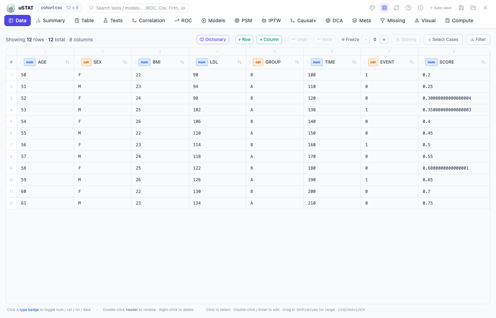

**How to do it (step by step):**
1. Upload is automatic — drag your CSV/XLSX onto the dropzone, or click **Browse**.
   The Data tab opens by default and is the first thing the user sees.
2. **Type each variable.** In any column header, click the small type badge
   (`num` / `cat` / `txt` / `date`) to cycle to the correct type. Do this for
   *every* column before running analyses — pickers in other tabs only list the
   columns whose type matches (e.g. a t-test only offers `num` outcomes).
3. **Add labels (optional but recommended).** Click a column name → **Dictionary**
   to set a human-readable label and value labels (e.g. `0 → No`, `1 → Yes`).
   These labels appear on every chart and table downstream.
4. **Check missingness.** Each header shows a red badge like `103✕ · 13%`
   (count + percent missing). To see only the rows with gaps, click **⚠ Missing**
   in the toolbar.
5. **Clean if needed.** Use **Select Cases** (build a rule like `age ≥ 18 &
   sex = M`) or per-column **Filter** to subset. **+ Row / + Column** to add
   data; double-click any cell to edit it in place. **Undo/Redo** and **Freeze**
   columns are in the toolbar.
6. **Recompute after edits.** Any change shows an **Apply** / **Save** affordance;
   confirm it so the typed/cleaned state persists for the other tabs.

**Tell the user:** "Type and clean your data here first — every other tab reads
these definitions. A mistyped variable (e.g. a number stored as text) silently
disappears from downstream analyses."

---

### 3.2 Summary — descriptives & distribution plots
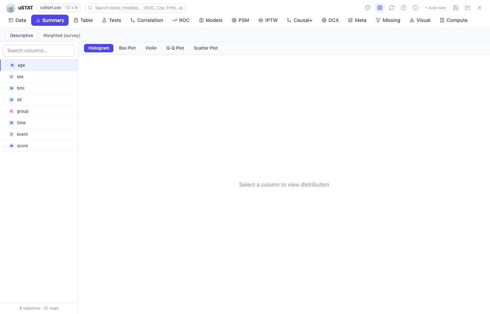

**How to do it:**
1. Go to **Summary → Descriptive** (the **Weighted** sub-tab is for survey-weighted
   data — bring a weights column).
2. Pick one numeric variable from the **Variable** dropdown.
3. Read the stat table: n, mean, SD, median, IQR, range, skewness, kurtosis, and a
   Shapiro-Wilk normality p-value.
4. Switch the plot with the buttons above the chart: **Histogram**, **Boxplot**,
   **Violin**, **Q-Q**.
5. **(Optional) Compare groups:** choose a categorical **Group by** variable to
   split the distribution side-by-side.
6. **Use the Q-Q plot to choose your test:** points on the line ≈ normal → use a
   parametric test (t-test/ANOVA) in the Tests tab. Strong S-curve departure →
   use the non-parametric equivalent (Mann-Whitney/Kruskal-Wallis).

---

### 3.3 Table — clinical "Table 1"
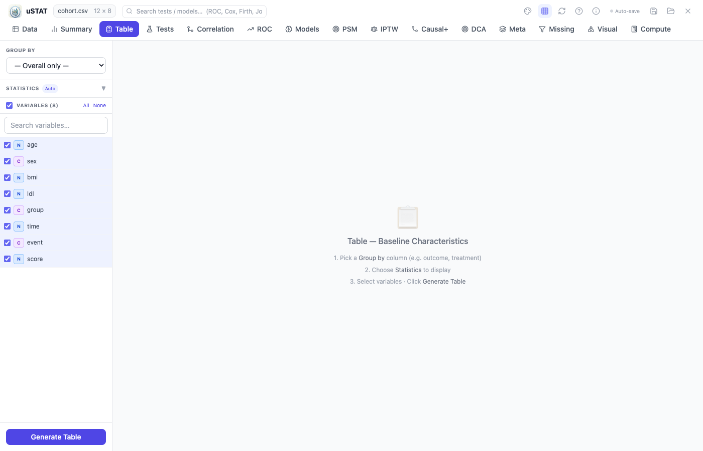

**How to do it:**
1. Go to the **Table** tab.
2. Pick the **Grouping variable** (e.g. `treatment_arm` with levels
   *Placebo* / *Drug*). Leave it blank for a single-arm descriptive table.
3. Tick the baseline variables you want in the left list.
4. uSTAT auto-selects the right summary per row: mean±SD for normal numeric,
   median[IQR] for skewed, n(%) for categorical — and the correct comparison
   test (t-test / Mann-Whitney / χ² / Fisher) with a p-value column.
5. Tweak defaults in the options panel (e.g. force median for a specific
   variable, change the number of decimals).
6. Click **Export** for a publication-ready (Word/CSV) table.

---

### 3.4 Tests — hypothesis tests
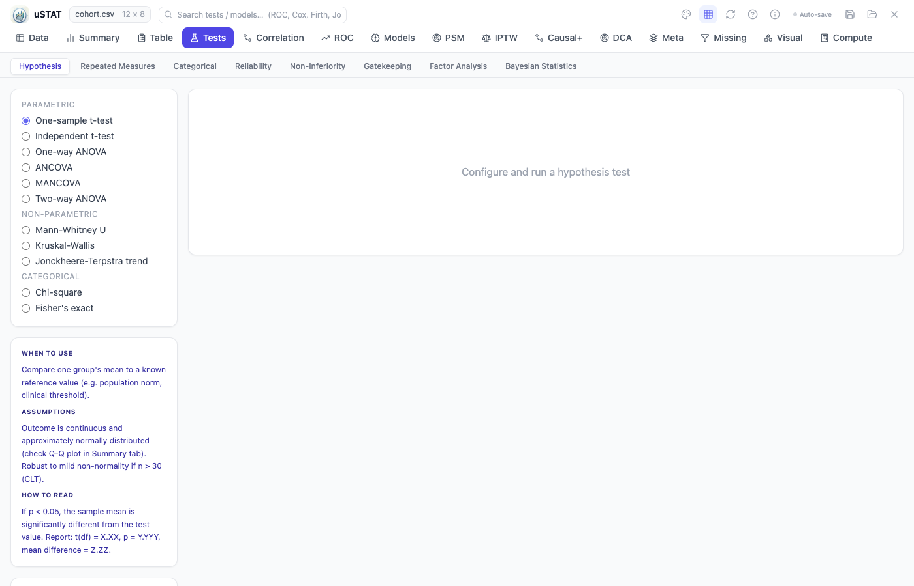

**How to do it:**
1. Go to the **Tests** tab and pick the right **sub-tab** for your question:
   - **Hypothesis** — t, ANOVA, Mann-Whitney, Kruskal-Wallis, Jonckheere, χ², Fisher
   - **Repeated Measures** — paired t, Wilcoxon, RM-ANOVA, Friedman, mixed ANOVA
   - **Categorical** — one/two proportions, McNemar, Cochran Q, Mantel-Haenszel, trend
   - **Reliability** — Cronbach α, ICC, Cohen/Fleiss κ
   - **Non-Inferiority**, **Gatekeeping**, **Factor Analysis** (PCA), **Bayesian**
2. In the left list, click the **test name** you want.
3. In the form that appears, assign the variables: **Outcome** (and **Group** /
   **Paired column** / **Strata** where the test needs them).
4. Read the *When to use / Assumptions / How to read* card on the right — it
   tells the user whether the assumptions are met and how to interpret the result.
5. Click **Run**. The result panel shows the statistic, p-value, effect size,
   and a plain-English conclusion.
6. **Picking parametric vs non-parametric:** check the Q-Q plot in Summary first.
   Roughly normal → t-test/ANOVA. Not normal, or ordinal, or small n →
   Mann-Whitney/Kruskal. Categorical counts → χ²/Fisher (Fisher when any
   expected cell < 5).

### 3.5 Correlation
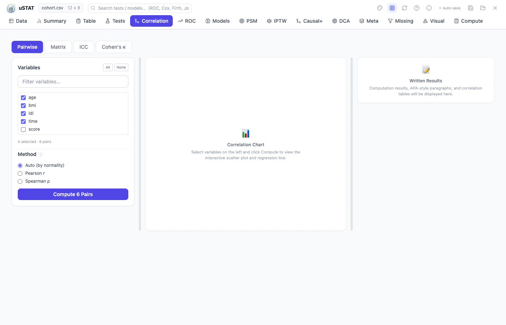

**How to do it:**
1. Go to the **Correlation** tab.
2. Tick ≥2 numeric or ordinal variables in the left list.
3. Pick the method: **Pearson** (linear relationship, both variables normal),
   **Spearman** (monotonic / ranked / ordinal / non-normal), or **Kendall**
   (robust, small samples, ties).
4. Click **Compute**. You get a coefficient matrix with p-values and a
   color-coded heatmap; click any cell for the scatter with a fitted line.
5. **Read it:** |r| < 0.3 weak, 0.3–0.6 moderate, > 0.6 strong. A p < 0.05 just
   says the correlation is distinguishable from zero, not that it is strong.

---

### 3.6 ROC — diagnostic accuracy
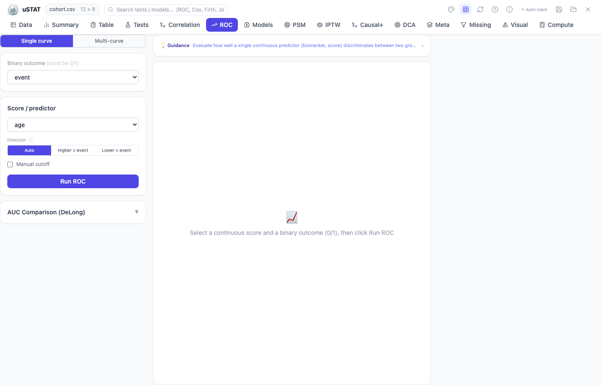

**How to do it:**
1. Go to the **ROC** tab.
2. Choose a numeric **Score / marker** (e.g. a lab value or a model's predicted
   probability) and a binary **Outcome (0/1)**.
3. Click **Compute**. You get AUC with 95% CI, the **optimal cutoff** (Youden J),
   and sensitivity/specificity at that cutoff.
4. **Compare markers:** switch to **Multi-curve** and tick several scores. The
   **DeLong** test then tells you whether two AUCs differ significantly.
5. **Combine markers:** use **Combined model** — uSTAT fits a logistic
   combination of the selected markers and reports the combined AUC (is the
   panel better than any single marker?).
6. **Read it:** AUC 0.5 = no discrimination, 0.7 = acceptable, 0.8 = good,
   0.9 = excellent. If the CI crosses 0.5, the marker is not informative.

---

### 3.7 Models — Regression
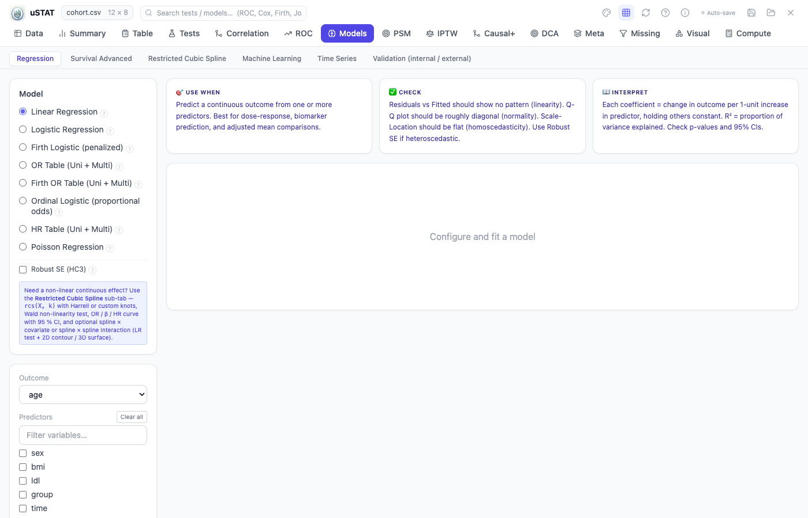

**How to do it:**
1. Go to **Models → Regression**.
2. Pick the model in the left list matching your outcome type:
   - **Linear** — continuous outcome (e.g. blood pressure)
   - **Logistic / Firth** — binary 0/1 outcome (rare events → Firth penalized)
   - **Poisson / Negative Binomial** — count outcome
   - **Gamma** — strictly-positive continuous (e.g. cost, LOS)
   - **Ordinal** — ordered categories (e.g. NYHA I–IV)
3. Choose the **Outcome**, then tick the **Predictors**.
4. (Optional) Set options: **Robust SE** (heteroscedasticity), **imputation**
   (listwise / MICE), **interactions** (add e.g. `age×sex`), **scale factors**.
5. Click **Fit**. Output: a coefficient table (β for linear, **OR** for
   logistic, **IRR** for Poisson) with 95% CI + p, model-fit stats (R², AIC),
   and a plain-English summary.
6. **For ordinal logistic**, check the **Brant test** of the proportional-odds
   assumption — green = holds, amber = violated (the offending predictors are
   named; consider a multinomial or partial proportional-odds model).

---

### 3.8 Models — Survival Advanced
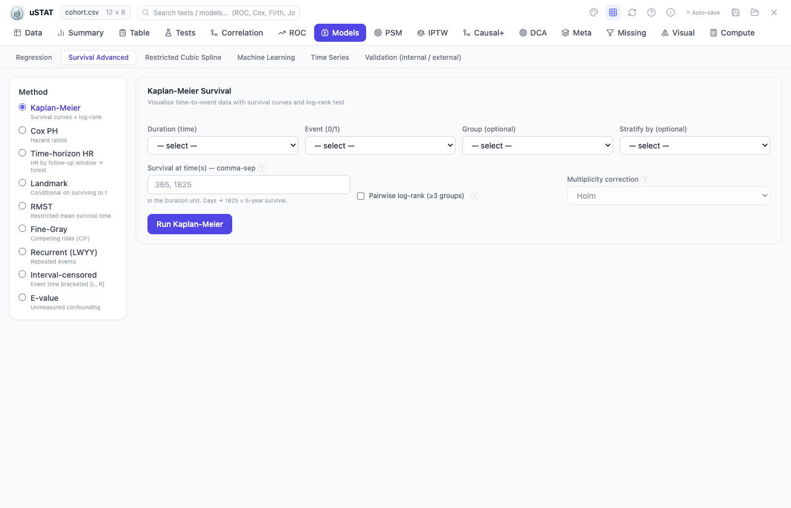

**How to do it:**
1. Go to **Models → Survival Advanced**. The left list holds the methods:
   **Kaplan-Meier, Cox PH, Time-horizon HR, Landmark, RMST, Fine-Gray
   (competing risks), Recurrent LWYY, Interval-censored, E-value**.
2. **Common inputs** every method asks for: a numeric **Duration (time)** column
   and a binary **Event (0/1)** column. Add a **Group** to compare curves, or a
   **Stratify** variable to stratify the Cox model.
3. **Kaplan-Meier:** pick Duration + Event + Group → curves with log-rank p.
4. **Cox PH:** add the **predictors** you want hazard ratios for → coefficient
   table with HR, 95% CI, p, and the proportional-hazards assumption test.
5. **Interval-censored** (event only known within a bracket — e.g. recurrence
   detected at a scheduled scan): pick the **lower** and **upper** bound columns
   (leave upper blank for still-event-free subjects) + optional covariates →
   Turnbull NPMLE curve + Weibull time-ratio / HR table.
6. **Time-horizon HR / Landmark:** restrict the analysis to a fixed follow-up
   window (e.g. 12-month HR) or a landmark time point — useful for
   non-proportional hazards.

### 3.9 PSM — propensity-score matching
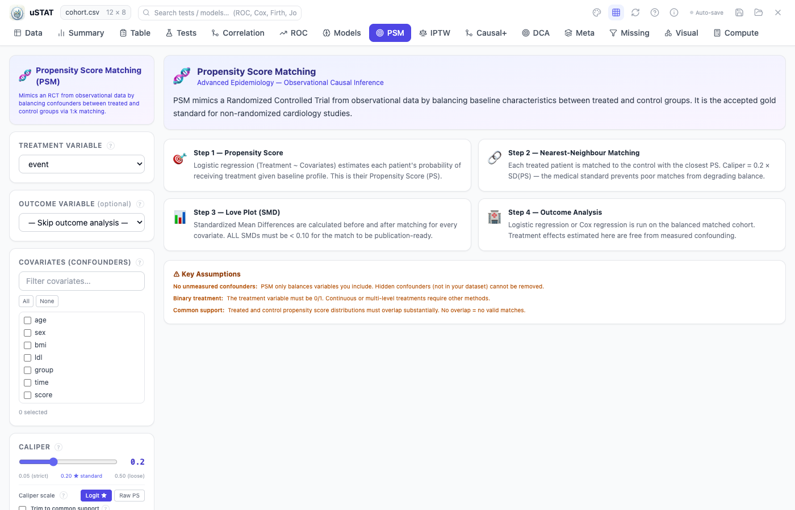

**How to do it:**
1. Go to the **PSM** tab.
2. Choose the **Treatment** variable (must be binary 0/1 — encode this in the
   Data tab first).
3. Tick the **Covariates** you want to balance on (the confounders).
4. Choose the **Outcome** (binary or survival). Pick a **caliper** (default
   0.2 of the logit PS SD is standard) and the **matching ratio** (1:1, 1:2, …).
5. Click **Run**. uSTAT estimates the propensity score, matches treated↔control,
   and reports:
   - **Balance diagnostics** — standardized mean differences before/after, a
     **Love plot**, and common-support check.
   - **Matched treatment effect** — the ATT (average treatment effect on the
     treated) with CI.
6. **Read it:** if post-match SMDs are all < 0.1, the groups are balanced and
   the effect estimate is trustworthy. If not, tighten the caliper or add
   exact-match variables.

---

### 3.10 IPTW — inverse-probability weighting
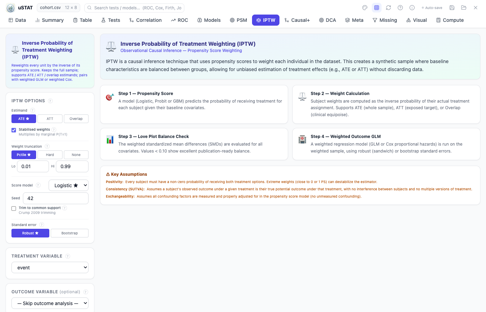

**How to do it:**
1. Go to the **IPTW** tab.
2. Same first three inputs as PSM: **Treatment** (0/1), **Covariates**, **Outcome**.
3. Pick the **estimand**: **ATE** (average treatment effect, whole population),
   **ATT** (treated only), or **overlap** (substantive-effect population).
4. (Optional) **Stabilize** the weights and set **truncation** (e.g. clip at the
   99th percentile) if the weight distribution has extreme tails.
5. Click **Run**. uSTAT reports: the propensity model, the weight distribution
   (effective sample size), balance after weighting, and the weighted effect.
6. **When to pick IPTW over PSM:** use IPTW when you don't want to discard
   unmatched subjects, or when you want the ATE rather than the ATT.

---

### 3.11 Causal+ — modern causal methods
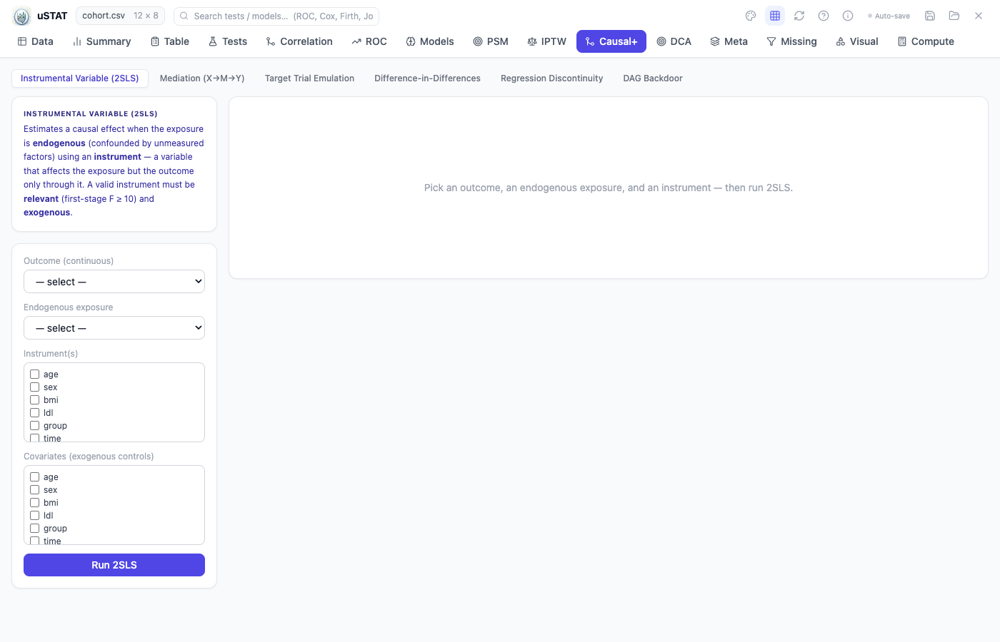

**How to do it:**
1. Go to the **Causal+** tab and pick a method from the left list:
   - **IV / 2SLS** — instrumental variable (needs an instrument that affects
     exposure but not outcome directly)
   - **Mediation** — decomposes a total effect into ACME (through the mediator)
     + ADE (direct), with bootstrap CIs
   - **SEM / Path analysis** — multi-treatment, multi-mediator (parallel or serial chain), multi-outcome; lavaan-style models, bootstrap CIs on indirects, global fit (CFI/TLI/RMSEA/SRMR)
   - **Target-trial emulation** — formal emulation of a pragmatic trial
   - **Difference-in-Differences** — pre/post × treated/control
   - **Regression discontinuity** — sharp/soft cutoff on a running variable
   - **DAG backdoor analysis** — paste a graph, get the minimal adjustment set
2. Assign the method-specific roles. Examples:
   - **IV/2SLS:** Outcome + Endogenous exposure + Instrument(s) + Covariates
   - **Mediation:** Outcome + Treatment + Mediator + Covariates
   - **DiD:** Outcome + Group (0/1) + Time (0/1) + Covariates
3. Click **Run**. Each method reports its estimate, the identifying assumption,
   and a sensitivity check where available.

**SEM / Path analysis (new tab inside Causal+):**

Use when you need multiple outcomes, multiple parallel mediators, serial mediator chains
(M1 → M2 → Y), or multiple treatments in one model (Hayes PROCESS 4/6/80/81 and beyond).
The single-mediator / single-outcome case is still simpler in the dedicated **Mediation** tab.

**How to do it (step by step):**
1. Go to **Causal+** and select **SEM / Path analysis** from the left list.
2. Pick **Treatments** (multi-select; ≥1 required).
3. Pick **Mediators** (multi-select; ≥1 required). If ≥2 mediators and you want a
   serial chain (M1→M2→…→Y) rather than all parallel, tick **Serial chain**.
4. Pick **Outcomes** (multi-select; ≥1 required; continuous variables).
5. (Optional) Pick **Covariates** to adjust for.
6. Set **Bootstrap resamples** (default 5000 = PROCESS standard; allowed 100–20000).
7. (Advanced) If desired, paste a custom lavaan model string into the textarea
   — this completely overrides the auto-built syntax.
8. Click **Run**.
9. Read the **indirect effects table**: a 95% bootstrap CI that does not contain
   zero means the indirect (mediated) effect is significant.
10. Check the **fit indices block**: CFI / TLI ≥ 0.95, RMSEA ≤ 0.06 and SRMR ≤ 0.08
    together indicate good global model fit. Also review the path coefficients,
    direct effects, total effects, and the echoed lavaan specification.

---

### 3.12 DCA — decision-curve analysis
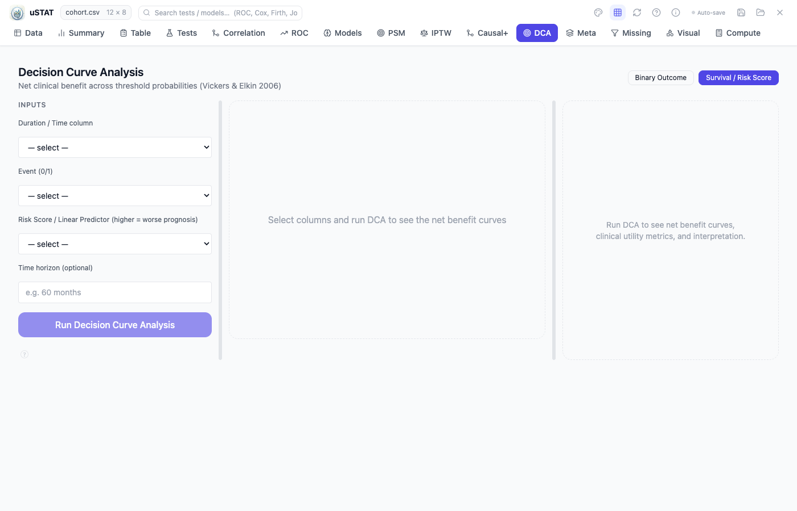

**How to do it:**
1. Go to the **DCA** tab.
2. Either provide a column of **predicted risks** directly, or give uSTAT the
   **predictors** + **binary outcome (0/1)** and it fits a logistic model to
   derive the risks.
3. (Optional) Set the **threshold probability range** to scan (default 1–99%).
4. Click **Compute**. The net-benefit curve plots your model against the
   *treat-all* and *treat-none* reference strategies across thresholds.
5. **Read it:** the model is **clinically useful** over a threshold range where
   its net benefit is higher than both treat-all and treat-none. Use this to
   justify a prediction model's clinical value beyond AUC.

### 3.13 Meta — meta-analysis
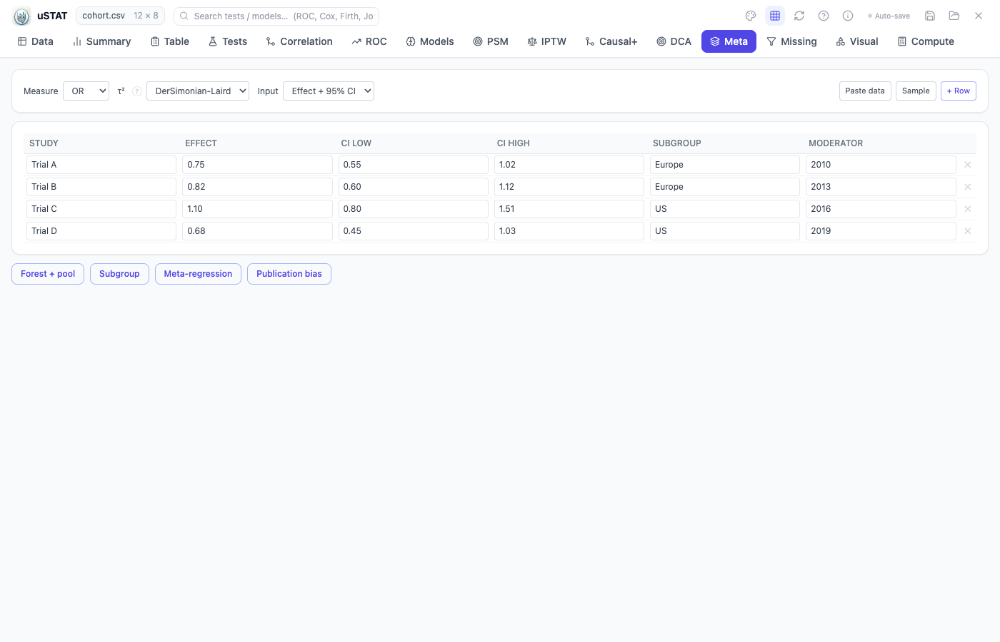

**How to do it:**
1. Go to the **Meta** tab.
2. **Enter one row per study.** For each study provide either:
   - an **effect estimate + 95% CI** (or + SE), or
   - a **2×2 table** (`e1, n1, e2, n2`) for OR/RR/RD measures.
3. Pick the **measure** (OR / RR / RD / SMD / MD). OR/RR/RD are analyzed on the
   log scale automatically.
4. Click **Analyze**. You get a random-effects pooled estimate (DerSimonian-Laird
   by default; switch to PM in options), a **forest plot**, and heterogeneity
   diagnostics: **I², τ², Q-test**.
5. **Subgroup analysis:** add a `subgroup` label to each study, then run
   **Subgroup** to pool within groups and test between-group heterogeneity.
6. **Meta-regression:** add a numeric `moderator` (e.g. mean age) and run
   **Regression** to see if it explains the between-study variance.
7. **Publication bias:** run **Bias** for the Egger test, Begg rank test,
   funnel plot, and trim-and-fill adjusted estimate.

---

### 3.14 Missing — audit & imputation
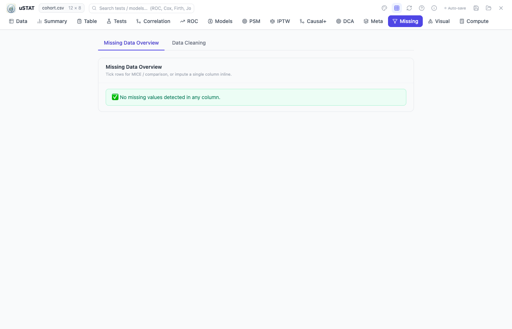

**How to do it:**
1. Go to the **Missing** tab.
2. The **pattern** view shows a heatmap of which cells are missing per variable
   and which patterns co-occur, plus per-variable counts and percentages.
3. Run **Little's MCAR test** — p > 0.05 ⇒ data are consistent with
   missing-completely-at-random (simple imputation is OK); p < 0.05 ⇒
   missing-at-random, use MICE.
4. **MNAR sensitivity** (if you suspect data are missing-not-at-random): run the
   delta-adjustment / pattern-mixture analysis to see how robust the conclusion
   is to varying the missingness assumption.
5. **Impute with MICE:** choose the columns to impute + number of imputations
   (default 5) → uSTAT produces completed datasets that downstream models pool
   using **Rubin's rules** (the regression tabs accept MICE imputation in their
   options).
6. **Compare strategies** side-by-side: mean / median / MICE / listwise to see
   how each changes the estimate.

---

### 3.15 Visual — model visuals, charts, forest builder
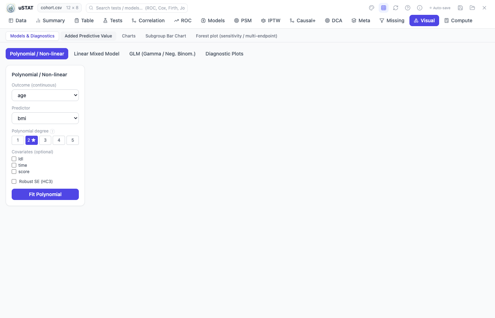

**How to do it (per sub-tab):**
1. **Models & Diagnostics** — pick a fitted model (from the Models tab) to view
   its diagnostic plots: residuals vs fitted, Q-Q, leverage, VIF, coefficient
   forest.
2. **Charts** — build a custom plot from scratch: choose **Histogram / Boxplot /
   Violin / Scatter / Bar / Line**, assign the axes, add a group/color, export PNG.
3. **Subgroup Bar** — compare a numeric (mean + CI) or percentage outcome across
   two factors (e.g. mean age by treatment × sex). Great for interaction
   visualizations.
4. **Forest plot** — the publication-ready forest builder. Either **paste rows**
   (label, estimate, CI, weight) directly, or **load from a model** (Cox /
   logistic / meta). Toggle log vs linear scale, sort by effect or p, add group
   sub-headings, and run the built-in random-effects meta-analysis for a pooled
   diamond + I²/τ².
5. **Added Predictive Value** — compare a base model vs base + new marker:
   **ΔAUC, NRI, IDI** to decide whether the new marker improves prediction.

---

### 3.16 Power — power & sample size
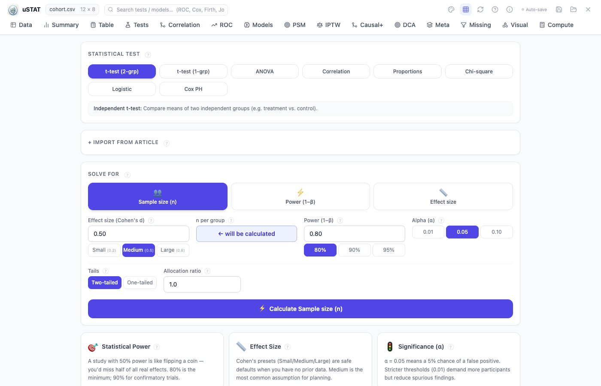

**How to do it:**
1. Go to the **Power** tab (also reachable from the splash screen — **no data
   upload needed**).
2. Pick the **test**: t-test, ANOVA, correlation, proportions, χ², logistic
   regression, or Cox.
3. Choose **solve for**: **sample size** (given a target power), **power**
   (given n), or **minimum detectable effect** (given n and power).
4. Enter the shared inputs: **α** (usually 0.05), **power** (usually 0.80 or
   0.90), and the **effect size**.
5. Add the test-specific fields — e.g. logistic needs the OR + event prevalence;
   Cox needs the HR + event rate + exposed fraction; proportions needs p₁ and p₂.
6. Read the result + the **power curve** (how power changes with n). Use this for
   protocol / grant sample-size justification.

---

## 4. Suggested workflow (what to tell a new user)

1. **Data tab** — fix variable types, check the missing badges, subset if needed.
2. **Summary / Table 1** — describe the cohort, check distributions (Q-Q).
3. **Missing tab** — if gaps are substantial, run MICE before modelling.
4. **Pick the analysis** from the Master Test Index (Section 2) by question +
   variable types.
5. **Run** it in the matching tab; read the on-panel *When to use / Assumptions
   / How to read* card.
6. **Validate & report** — for prediction models use Validation/DCA/Added Value;
   export tables/plots; double-check key numbers in SPSS/R/Stata before
   publishing.

> Reminder for the user: uSTAT is not a validated medical device. Anonymise data
> before upload (no names, MRNs, DOBs).
